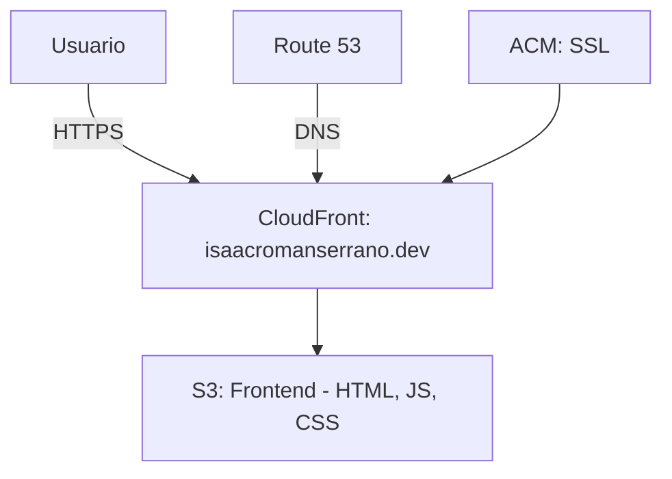

Una aplicación web estática desplegada en AWS S3 y distribuida mediante CloudFront, diseñada como portfolio personal con alta escalabilidad y bajo coste.
(https://isaacromanserrano.dev)

## Tabla de Contenidos

- [Descripción](#descripción)
- [Tecnologías Utilizadas](#tecnologías-utilizadas)
- [Arquitectura](#arquitectura)
- [Pasos de Implementación](#pasos-de-implementación)
- [Políticas del Bucket S3](#políticas-del-bucket-s3)
- [Validación del Certificado SSL](#validación-del-certificado-ssl)
- [Configuración de CloudFront y Route 53](#configuración-de-cloudfront-y-route-53)
- [Uso](#uso)
- [Contribuciones](#contribuciones)
- [Licencia](#licencia)

## Descripción

Este proyecto despliega un portfolio personal como una web estática alojada en **AWS S3**, distribuida a través de **CloudFront** para garantizar alto rendimiento y baja latencia. La arquitectura serverless permite escalabilidad y eficiencia económica, utilizando un dominio personalizado con certificados SSL gestionados por **ACM** y enrutamiento DNS mediante **Route 53**.

El objetivo es demostrar conocimientos en los servicios de AWS mientras se crea un portfolio profesional para mostrar proyectos personales.

## Tecnologías Utilizadas

- **AWS**:
  - **S3**: Almacenamiento de archivos estáticos.
  - **CloudFront**: CDN para distribución de contenido con baja latencia.
  - **ACM**: Gestión de certificados SSL para HTTPS.
  - **Route 53**: Servicio DNS para enrutamiento del dominio.
- **Frontend**:
  - **Vite**: Bundler rápido para desarrollo y producción.
  - **TypeScript**: Superset de JavaScript para tipado estático.
  - **Tailwind CSS**: Framework de CSS basado en utilidades.
  - **Node.js**: Entorno para desarrollo y empaquetado.

## Arquitectura

El frontend se aloja en un bucket de **AWS S3** configurado para hospedaje de sitios web estáticos, proporcionando almacenamiento eficiente y económico. **CloudFront**, el CDN de AWS, acelera la entrega mediante el almacenamiento en caché en Edge Locations globales, garantizando baja latencia. **Route 53** gestiona el enrutamiento DNS del dominio personalizado (`isaacromanserrano.dev`), mientras que **ACM** proporciona el certificado SSL para habilitar HTTPS.

**Diagrama de Arquitectura**:



## Pasos de Implementación

1. **Preparación del frontend**:
   - Generé los archivos estáticos (HTML, CSS, JS) optimizados en la carpeta `/dist` usando Vite.
2. **Creación del bucket S3**:
   - Creé un bucket llamado `portfolio-isaac-cloud` con acceso público habilitado.
3. **Carga de archivos**:
   - Subí los contenidos de la carpeta `/dist` al bucket.
4. **Configuración de hospedaje web**:
   - Habilite la opción **Static Website Hosting** en las propiedades del bucket, especificando `index.html` como documento raíz.
5. **Política de acceso**:
   - Apliqué una política de bucket para permitir lectura pública (ver [Políticas del Bucket S3](#políticas-del-bucket-s3)).
6. **Solicitud de certificado SSL**:
   - Solicité un certificado público en **ACM** para el dominio `isaacromanserrano.dev` con validación DNS.
7. **Validación DNS**:
   - Configuré los registros CNAME en el proveedor DNS para validar el certificado (ver [Validación del Certificado SSL](#validación-del-certificado-ssl)).
8. **Configuración de CloudFront**:
   - Creé una distribución apuntando al endpoint del bucket S3 y añadí `isaacromanserrano.dev` como CNAME.
9. **Asignación del certificado**:
   - Asocié el certificado SSL de ACM a la distribución de CloudFront.
10. **Configuración de Route 53**:
    - Creé una **Hosted Zone** en Route 53 y configuré un registro A (alias) para apuntar `isaacromanserrano.dev` a la distribución de CloudFront.

## Políticas del Bucket S3

La siguiente política permite acceso público de solo lectura a los objetos del bucket:

```json
{
    "Version": "2012-10-17",
    "Statement": [
        {
            "Sid": "PublicReadGetObject",
            "Effect": "Allow",
            "Principal": "*",
            "Action": "s3:GetObject",
            "Resource": "arn:aws:s3:::portfolio-isaac-cloud/*"
        }
    ]
}
```

## Validación del Certificado SSL

- Solicité un certificado en **AWS Certificate Manager (ACM)** para `isaacromanserrano.dev`.
- Utilicé validación DNS, añadiendo el registro CNAME proporcionado por ACM en el panel DNS de mi proveedor (Namecheap).
- La propagación DNS se completó en minutos, y el certificado fue emitido automáticamente.

## Configuración de CloudFront y Route 53

- **CloudFront**:
  - Configuré una distribución con el bucket S3 como origen.
  - Añadí `isaacromanserrano.dev` como CNAME alternativo.
  - Asocié el certificado SSL de ACM para habilitar HTTPS.
- **Route 53**:
  - Creé una Hosted Zone para `isaacromanserrano.dev`.
  - Configuré un registro A (alias) apuntando a la distribución de CloudFront.

## Uso

1. Clona el repositorio: `git clone [<URL_DEL_REPOSITORIO>`](https://github.com/IsaacRomanSerrano/portfolio/)
2. Instala dependencias: `npm install`
3. Construye el proyecto: `npm run build`
4. Despliega los archivos generados en `/dist` al bucket S3.
5. Accede al portfolio en `https://isaacromanserrano.dev`.

## Contribuciones

¡Las contribuciones son bienvenidas! Por favor, sigue estos pasos:
1. Haz un fork del repositorio.
2. Crea una rama para tu funcionalidad: `git checkout -b feature/nueva-funcionalidad`
3. Realiza tus cambios y haz commit: `git commit -m "Añadir nueva funcionalidad"`
4. Envía un pull request.

down…]()
