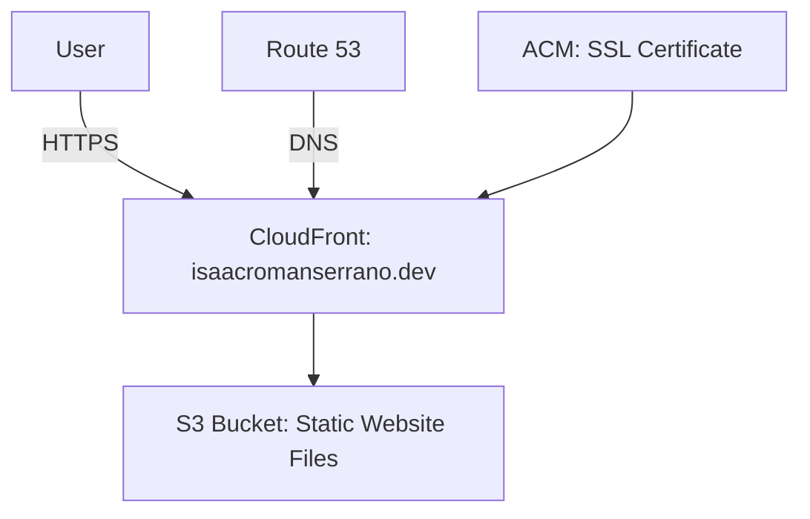

# 🌐 Portfolio deployed through AWS

> Static website fully deployed on **AWS** using **S3**, **CloudFront**, and **Route 53**.  
> Designed as a **personal portfolio** with high scalability, security, and minimal cost.  
> 🔗 [https://isaacromanserrano.dev](https://isaacromanserrano.dev)

---

## 📘 Overview
This project demonstrates a **serverless architecture** for hosting a personal portfolio using **AWS S3** as storage, **CloudFront** as CDN, **ACM** for SSL management, and **Route 53** for DNS routing.

The main objective is to apply **cloud best practices** (scalability, global distribution, and cost optimization) while building a professional showcase website.

---

## 🧰 Technologies

### **AWS Services**
| Service | Purpose |
|----------|----------|
| **S3** | Static website hosting (HTML, CSS, JS). |
| **CloudFront** | Global content distribution (CDN). |
| **ACM** | SSL certificate management for HTTPS. |
| **Route 53** | Domain name resolution for `isaacromanserrano.dev`. |

### **Frontend**
| Tool | Purpose |
|------|----------|
| **Vite** | Frontend bundler for optimized builds. |
| **TypeScript** | Type-safe development. |
| **Tailwind CSS** | Utility-first styling. |
| **Node.js** | Build and deployment environment. |

---

## 🧱 Architecture

The frontend is stored in an **S3 bucket** configured for static hosting and distributed globally through **CloudFront**.  
**ACM** provides SSL certificates to enable HTTPS, and **Route 53** manages custom domain routing.

⚙️ Implementation Steps

Frontend Build

Generate static files using Vite (npm run build).

S3 Configuration

Create bucket portfolio-isaac-cloud → enable Static Website Hosting.

Set index.html as root document.

Upload

Upload /dist contents to S3.

Bucket Policy

Apply public read-only policy:

{
    "Version": "2012-10-17",
    "Statement": [
        {
            "Effect": "Allow",
            "Principal": "*",
            "Action": "s3:GetObject",
            "Resource": "arn:aws:s3:::portfolio-isaac-cloud/*"
        }
    ]
}

ACM Certificate

Request SSL certificate for isaacromanserrano.dev with DNS validation.

DNS Validation

Add CNAME record from ACM into DNS provider (Namecheap).

CloudFront Distribution

Origin: S3 bucket.

Alternate Domain: isaacromanserrano.dev.

SSL: ACM certificate.

Route 53 Configuration

Create hosted zone and A record alias to CloudFront distribution.

🔒 SSL Validation Process

Certificate requested from AWS Certificate Manager (ACM).

DNS validation through CNAME record at Namecheap.

Issued automatically after propagation (~5 minutes).

🌍 CloudFront + Route 53 Setup

CloudFront caches content in edge locations globally.

Route 53 manages the domain’s DNS resolution and connects it to CloudFront.

Combined, they ensure high availability, low latency, and HTTPS security.

🚀 Usage
git clone https://github.com/IsaacRomanSerrano/portfolio.git
cd portfolio
npm install
npm run build

Deploy /dist contents to your S3 bucket and access:
➡️ https://isaacromanserrano.dev

🧾 Results and Key Takeaways

⚡ Fast global delivery through CloudFront edge caching.

💰 Low-cost hosting (under $1/month).

🧩 Scalable serverless architecture.

🔒 Fully secured with HTTPS and DNS validation.

🤝 Contributing

Contributions are welcome!

Fork the repo

Create a branch: git checkout -b feature/your-feature

Commit and push your changes

Open a Pull Request

📜 License

This project is open-source and available under the MIT License.
